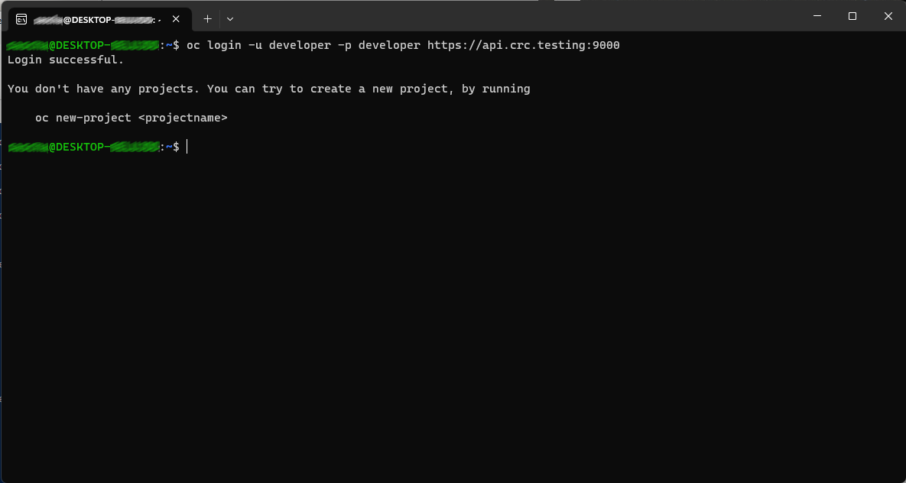

= OpenShift Local mit der WSL nutzen
:toc:

== Vorwort

OpenShift Local ist eine gute Sache, um Dinge auf dem eigenen Rechner auszuprobieren. Installiert man OpenShift Local unter Windows, dann möchte man oft gerne die WSL nutzen, um über die Bash auf OpenShift zuzugreifen, da man in der PowerShell unter Windows nicht immer alle Befehle installieren kann.

Diese Anleitung soll helfen, die Verbindung von der WSL zu OpenShift Local auf Windows herzustellen. Schritt für Schritt, so dass es eigentlich nicht schiefgehen kann.

Die eigentliche Quelle der Lösung ist: https://access.redhat.com/discussions/6982441

== Schritt 1: Kopieren der notwendigen Dateien

In Windows findet man in seinem Benutzerprofil unter "C:/Users/<Benutzername>" einen Ordner ".kube". Dort liegt eine "config"-Datei und ein "cache"-Ordner.

Diese beiden Dateien müssen nun in die WSL kopiert werden. Wenn sich im $HOME-Verzeichnis der WSL bereits ein ".kube"-Ordner befindet, dann liegen dort bereits eine "config"-Datei und ein "cache"-Ordner, die man zunächst löschen sollte und dann die entsprechenden Dateien aus dem obigen Windows-Verzeichnis kopiert. Liegt dort noch kein ".kube"-Ordner, dann einfach den gesamten Ordner von Windows in die WSL kopieren.

Dazu kann man einfach den Windows-Explorer nutzen. Unter Windows 11 sind die Dateien der WSL direkt verfügbar:

Aber auch unter Windows 10 ist es einfach, aus dem Windows-Explorer heraus auf die WSL zuzugreifen. Dazu einfach in die Pfadleiste im Explorer klicken und dort "\\wsl$" eingeben und <Enter> drücken:

== Schritt 2: Anpassen der "config"-Datei

Nachdem die "config"-Datei nun in der WSL ist, diese einmal mit z.B. "sudo vi ~/.kube/config" öffnen und dort überall den Port 6443 in Port 9000 ändern. Profis können natürlich auch "sed" nehmen.

== Schritt 3: Anpassen der WSL "hosts"-Datei

Im Windows-Ordner findet man unter "System32\drivers\etc" die "hosts"-Datei. Hier findet man eine oder mehrere Zeilen, welche sich auf OpenShift beziehen:

Zusätzlich benötigen wir hier die IP-Adresse des Windows-Rechners. In der Regel ist das 192.168.x.y.

Die Einträge der Windows "Hosts"-Datei müssen der "Hosts"-Datei der WSL, welche dort in "/etc/hosts" liegt, hinzugefügt werden und die IP am Anfang (127.0.0.1) durch die IP des Windows-Rechners ersetzt werden:

== Schritt 4: Einrichten der Forward-Rules unter Windows

Als nächstes benötigen wir ein Port-Forwarding unter Windows. Als erstes kann man sich einmal anschauen, ob da bereits etwas eingerichtet ist. Dazu öffnet man eine Powershell als Administrator. Vermutlich ist nichts eingerichtet, so dass der folgende Befehl auch nichts ausgibt:

[source]
----
netsh interface portproxy show v4tov4
----

Jetzt fügen wir zwei Forwards hinzu:

(Die hier verwendete "connectaddress" natürlich durch die IP-Adresse des eigenen Windows-Rechners ersetzen.)

[source]
----
netsh interface portproxy add v4tov4 listenaddress=192.168.178.10 listenport=9000 connectaddress=127.0.0.1 connectport=6443
----

[source]
----
netsh interface portproxy add v4tov4 listenaddress=192.168.178.10 listenport=9001 connectaddress=127.0.0.1 connectport=443
----

Schauen wir uns nun noch einmal die jetzt eingerichteten Forwards an, steht dort etwas wie:

[source]
----
PS C:\WINDOWS\system32> netsh interface portproxy show v4tov4

Abfragen auf ipv4:             Verbinden mit ipv4:

Adresse         Anschluss   Adresse         Anschluss
--------------- ----------  --------------- ----------
192.168.178.10  9000        127.0.0.1       6443
192.168.178.10  9001        127.0.0.1       443
----

== Schritt 5: Einrichten einer Firewall-Regel

Unter Windows müssen wir nun noch eine Firewall-Regel einrichten, damit wir die Ports, die wir für das Forwarding eingestellt haben, auch nutzen können. Dazu die "Windows"-Taste drücken und spätestens nach der Eingabe von "fire" sollte dort die Windows Defender Firewall zur Auswahl stehen.

Sind wir dann in der Oberfläche für die Windows-Firewall, können wir recht eine neue Regel anlegen:

Dort wählen wir aus, dass wir eine Regel für Ports erstellen wollen:

Und stellen dort die Ports 9000 und 9001 ein:

Nun wählen wir noch aus, dass wir die Verbindung zulassen:

Stellen ein, dass wir das nicht möchten, wenn wir mit einem öffentlichen Netz verbunden sind:

Und geben der Regel am Ende einen beliebigen Namen und stellen die Regel fertig.

== Schritt 6: Einloggen

Wenn wir nun die WSL öffnen, sollte das Einloggen funktionieren:

Viel Spaß!